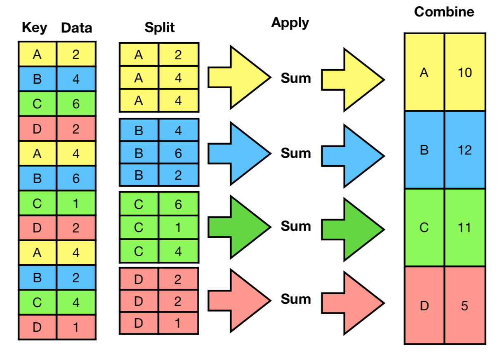
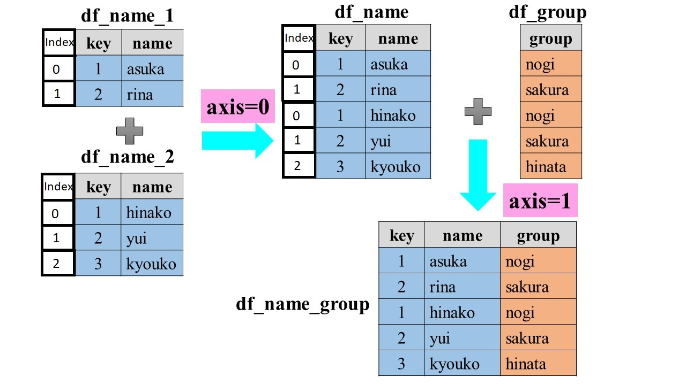
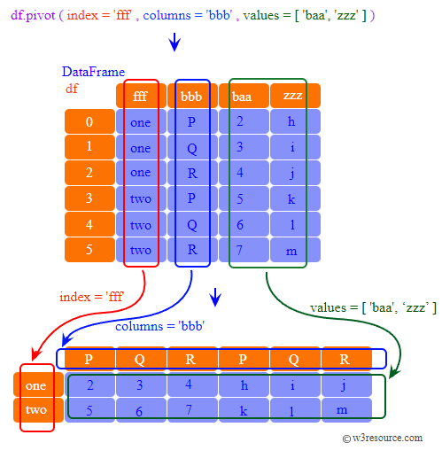
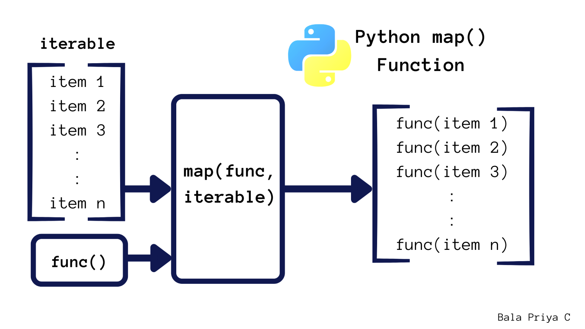

# Apunte 
## tiempo de ejecucio
%timeit df.apply(fun, axis=1)

## Pandas
### Sleción de filas y columnas data frame
```python
df[[<string>, <string>, ..., <string>]] # subset columnas
df[[<bool>, <bool>, ..., <bool>]]   # subset filas
```

### shape , size, memory_usage,  len -> (no  es pandas)
- shape:
Return a tuple
```python
df = pd.DataFrame({'col1': [1, 2], 'col2': [3, 4],
                   'col3': [5, 6]})
df.shape
(2, 3)
```

- size: Retorna int, cantidad de elementos que tiene el data frame, cuenta todos los valores incluso Nan
```python
df = pd.DataFrame({'col1': [1, 2], 'col2': [3, 4]})
df.size # filas X columnas
4
```

- memory_usage:
```python
DataFrame.memory_usage(index=True, deep=False)
```
Devuelve el uso de memoria de cada columna en bytes.

El uso de memoria puede incluir opcionalmente la contribución del índice y elementos del tipo de objeto .

Este valor se muestra en DataFrame.info de forma predeterminada. Esto se puede suprimir estableciendo pandas.options.display.memory_usageel valor False.

Ejemplo: Index = 32 bytes, string = 8 bytes, int = 8 bytes
```python
df
	Nombre	Edad
0	Juan	25
1	Ana	32
2	Pedro	18
3	Laura	47

memory_usage = df.memory_usage()
Index 132
Nombre 32
Edad 32
dtype: int64

```


- len: Retorna el tamaño (el número de elementos) de un objeto.
El argumento puede ser una secuencia (como una cadena, un objeto byte, una tupla, lista o rango) o una colección (como un diccionario, un set o un frozen set).
```python
df = pd.DataFrame({'col1': [1, 2], 'col2': [3, 4]})
len(df) # numeros de filas
2
```

- 

### astype()
```python
DataFrame.astype(dtype, copy=None, errors='raise')
```
Convierte un objeto pandas a un tipo  especificado dtype.
```python
d = {'col1': [1, 2], 'col2': [3, 4]}
df = pd.DataFrame(data=d)
df.dtypes
col1    int64
col2    int64
dtype: object

df.astype('int32').dtypes
col1    int32
col2    int32
dtype: object
```

### Columnas seleccion
Obtener la lista de labels de las columnas del data Frame
```python
nombres_columnas = df.columns
```
Sobreescribir los labels del DataFrame
```python
df.columns = [name,name2]   # No es conveniente
```
usar rename.

### rename
```python
DataFrame.rename(mapper=None, *, index=None, columns=None, axis=None, copy=None, inplace=False, level=None, errors='ignore')
```
Ejemplo:
```python
df = pd.DataFrame({"A": [1, 2, 3], "B": [4, 5, 6]})
df.rename(columns={"A": "a", "B": "c"})
   a  c
0  1  4
1  2  5
2  3  6
```

### reset_index()
```python
DataFrame.reset_index(level=None, *, drop=False, inplace=False, col_level=0, col_fill='', allow_duplicates=_NoDefault.no_default, names=None)
```
Restablecer el índice, o un nivel del mismo.

Restablezca el índice del DataFrame y utilice el predeterminado en su lugar. Si el DataFrame tiene un MultiIndex, este método puede eliminar uno o más niveles.

Ejemplo:
```python
df
         class  max_speed
falcon    bird      389.0
parrot    bird       24.0
lion    mammal       80.5
monkey  mammal        NaN

df.reset_index()
    index   class  max_speed
0  falcon    bird      389.0
1  parrot    bird       24.0
2    lion  mammal       80.5
3  monkey  mammal        NaN
```

### df = pd.read_csv("archivo.csv")

### df.info()
```py
DataFrame.info(verbose=None, buf=None, max_cols=None, memory_usage=None, show_counts=None)

```
verbose = informacion detallada, default = True

3. Acceder a columnas `df.name_col` o `df["name_col"]`

### map()
```python
DataFrame.map(func, na_action=None, **kwargs)
```
Hace lo mismo que la funcion `map` que esta incorporada nativo en pytho.

### unique()
```python
DataFrame.nunique(axis=0, dropna=True)
```
Retorna un serie, con número de elementos distintos. Puede ignorar los valores de NaN.

### groupby
```python
DataFrame.groupby(by=None, axis=_NoDefault.no_default, level=None, as_index=True, sort=True, group_keys=True, observed=_NoDefault.no_default, dropna=True)
```


al hacer:
```python
df.groupby["Key"] # es el split de la imagen anterior

df.groupby["Key"].mean() # split y a cada cuadrito se aplica la media -> A=10/3, B= 12/3, C= 11/3, D= 5/3
```
Notar que el indice cambia y es un nuevo data frame:
```
index mean
A     10/3
B     12/3
C     11/3
D     5/3
```

### transform()
```python
DataFrame.transform(func, axis=0, *args, **kwargs)
```
Ejemplo:
```python
df
         Date  Data
0  2015-05-08     5
1  2015-05-07     8
2  2015-05-06     6
3  2015-05-05     1
4  2015-05-08    50
5  2015-05-07   100
6  2015-05-06    60
7  2015-05-05   120

df.groupby('Date')['Data'].transform('sum')
0     55
1    108
2     66
3    121
4     55
5    108
6     66
7    121
Name: Data, dtype: int64
```

### apply
```python
DataFrame.apply(func, axis=0, raw=False, result_type=None, args=(), by_row='compat', **kwargs)
```
Aplicarle a una fila o columna una funcion

### loc
```python
DataFrame.loc
```
Acceda a un grupo de filas y columnas por etiqueta(s) o una matriz booleana.
Ejemplo:
```python
df:
            max_speed  shield
cobra               1       2
viper               4       5
sidewinder          7       8

# output
df.loc[['viper', 'sidewinder']]
# Selecionamos solo filas especificas
            max_speed  shield
viper               4       5
sidewinder          7       8
# Selecionamos la columna max_speed
df.loc['cobra':'viper', 'max_speed']
cobra    1
viper    4
Name: max_speed, dtype: int64
```

### iloc
Indexación basada puramente en ubicaciones enteras para selección por posición.
```python
df
      a     b     c     d
0     1     2     3     4
1   100   200   300   400
2  1000  2000  3000  4000

#  seleccionamos fila 0
df.iloc[0]
a    1
b    2
c    3
d    4
```

### set_index()
df.set_index(["Key"])

coloca un columna como indice, puede haber repetidos

### agg()
```python
DataFrame.agg(func=None, axis=0, *args, **kwargs)
```

ejemplo:
```python
df
    A	B	C
0	1.0	2.0	3.0
1	4.0	5.0	6.0
2	7.0	8.0	9.0
3	NaN	NaN	NaN

df.agg(['sum', 'min'])
        A     B     C
sum  12.0  15.0  18.0
min   1.0   2.0   3.0
```

### VER otros
- get_group()
new = df.groupby("key")
new.get_group("A")

- sample()
df.sample(10)   # 10 filas al azar
df.sample(frac=0.35)    % 35% de los datos

### concat()
```python
pandas.concat(objs, *, axis=0, join='outer', ignore_index=False, keys=None, levels=None, names=None, verify_integrity=False, sort=False, copy=None)
```
Concatena objetos pandas a lo largo de un eje particular.

Permite establecer lógica opcional a lo largo de los otros ejes.

También puede agregar una capa de indexación jerárquica en el eje de concatenación, lo que puede resultar útil si las etiquetas son iguales (o se superponen) en el número de eje pasado.



[link](https://datasciencemore.com/python-pandas-concat/)

Tener presente que los indices tambien se se concatenan.

### pivot()



[link](https://www.w3resource.com/pandas/dataframe/dataframe-pivot.php)


### fillna()
```python
DataFrame.fillna(value=None, *, method=None, axis=None, inplace=False, limit=None, downcast=_NoDefault.no_default)
```

Rellenar o Complete los valores NA/NaN utilizando el método especificado, para data Frames y series


## Funciones incorporadas en Python nativo [link](https://docs.python.org/es/3/library/functions.html)

### Iteradores y Iterables 

Un iterador es un objeto que contiene un número contable de valores.

Un iterador es un objeto sobre el que se puede iterar, lo que significa que puede recorrer todos los valores.

Técnicamente, en Python, un iterador es un objeto que implementa el protocolo del iterador, que consta de los métodos __iter__() y __next__().

[link](http://data.prep.soyhenry.com/clase_cinco/?utm_source=google&utm_medium=cpc&utm_campaign=GADS_SEARCH_ARG_FS_GEN&utm_content=FullStackDSA&gad=1&gclid=CjwKCAjw3dCnBhBCEiwAVvLcuw6gh6UONqWnhiN2zWtRG4zzL2GmIG8xEFo1sM4byshbxLS84Kc97RoC25YQAvD_BwE)
Se podría explicar la diferencia entre iteradores e iterables usando un libro como analogía. El libro sería nuestra clase iterable, ya que tiene diferentes páginas a las que podemos acceder. El libro podría ser una lista, y cada página un elemento de la lista. Por otro lado, el iterador sería un marcapáginas, es decir, una referencia que nos indica en qué posición estamos del libro, y que puede ser usado para “navegar” por él.

```python
# list of vowels
libro = ['pagina1', 'pagina2', 'pagina3']
marcapaginas = iter(libro)

print(next(marcapaginas))   
print(next(marcapaginas))    
print(next(marcapaginas))    

# Output:
pagina1
pagina2
pagina3
```

### map()
```python
map(function, iterable, *iterables)
```


La función `map` devuelve un objeto de tipo `map`, que es un iterador. Esto significa que puedes recorrer sus elementos uno por uno, pero no puedes acceder a ellos directamente como lo harías con una lista. Si necesitas acceder a los elementos del objeto `map` directamente, puedes convertirlo en una lista usando la función `list`. Por ejemplo:

```python
a = [1, 2, 3]
result = map(lambda x: x * 2, a)
result_list = list(result)
print(result_list)
```

En este ejemplo, usamos `map` para multiplicar cada elemento de la lista `a` por 2. Luego, convertimos el objeto `map` resultante en una lista usando la función `list` y lo asignamos a la variable `result_list`. Finalmente, imprimimos el contenido de `result_list`, que es una lista con los elementos [2, 4, 6].

También podemos aplicar a los dataFrames, siendo mas claros a las serie por que
```python
df["name_col"]   # retorna una serie, que es iterable
df["name_col"].map()    #creamos un objeto itereable
```

